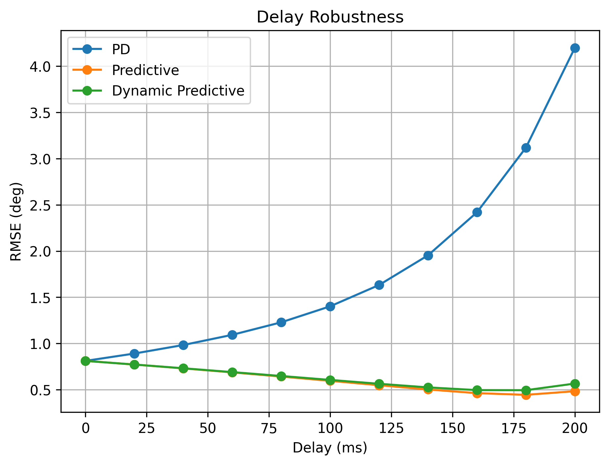
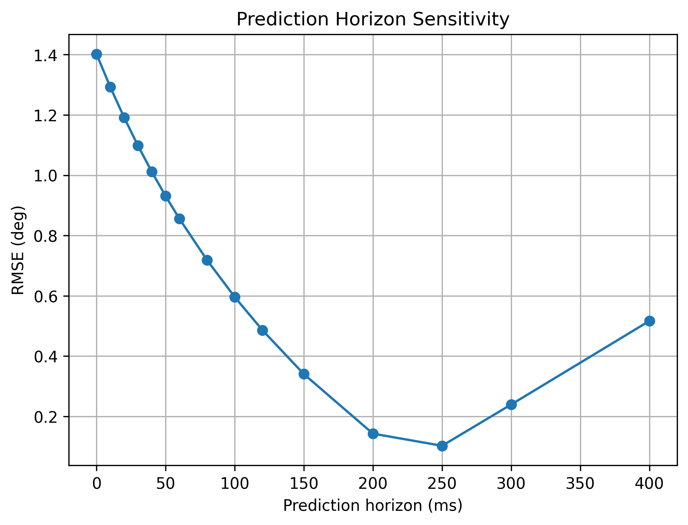
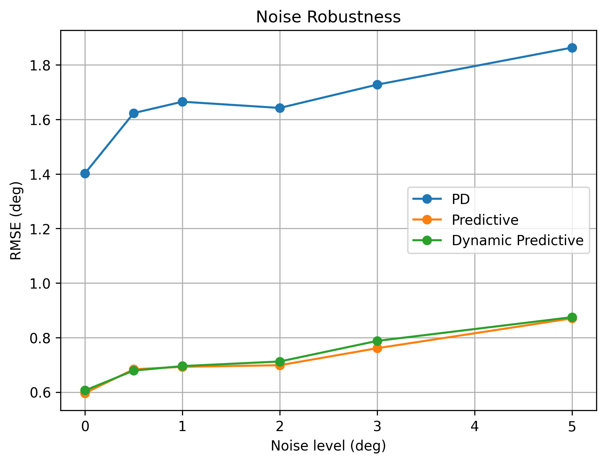
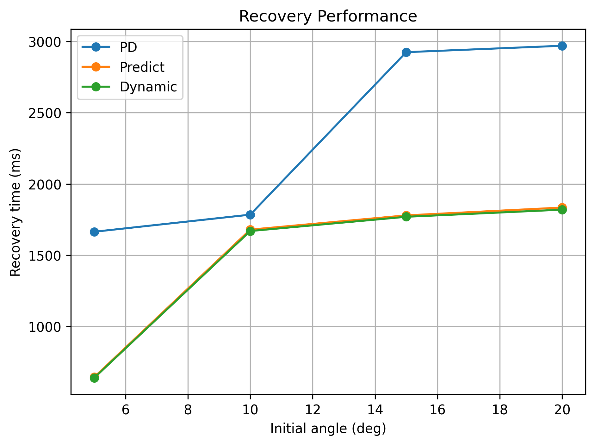

# Predictive Balance Simulation

[](https://www.python.org/downloads/)
[](https://opensource.org/licenses/MIT)

A simulation framework evaluating **Predictive Control Strategies** for unstable inverted pendulum balance systems under **feedback delays, measurement noise, and external disturbances**.

---

## 📌 Overview

Feedback delays and sensor noise are major challenges in real-time embedded control systems (e.g., two-wheeled balancing robots, humanoid robots). Standard PD controllers suffer from severe phase lags, leading to oscillations or instability when feedback delays increase.

This project implements and compares three controller architectures:
1. **Standard PD Controller**: Baseline proportional-derivative feedback.
2. **First-Order Predictive Controller**: Velocity-based state prediction ($T_p$).
3. **Dynamic Predictive Controller**: Acceleration-augmented second-order Taylor prediction using estimated natural system dynamics.

---

## 📊 Key Results

### 1. Delay Robustness Comparison
* **Observation**: As feedback delay increases from 0 to 200 ms, standard PD control quickly diverges (RMSE exceeds 4.2°). Predictive controllers effectively compensate for latency, maintaining RMSE under 0.8° across the tested delay range (0–200 ms).
<p align="center">
  
</p>

### 2. Prediction Horizon Sensitivity
* **Observation**: Evaluated under a fixed 100 ms system delay. Error decreases significantly as prediction horizon $T_p$ increases, achieving the minimum error within the tested range near $T_p = 250\text{ ms}$ before over-prediction phase lead causes error rebound.
<p align="center">
  
</p>

### 3. Noise Robustness
* **Observation**: A first-order low-pass filter ($\alpha = 0.8$) is applied under noisy measurement conditions. Predictive models consistently outperform standard PD across all noise levels ($0^\circ \sim 5.0^\circ$).
<p align="center">
  
</p>

### 4. Recovery Time Under Initial Disturbances
* **Observation**: Evaluated against initial tilt angles from 5° to 20° (recovery threshold $<1.0^\circ$ for 0.25s). Within the tested disturbance range, predictive controllers achieve up to **38% faster recovery times** compared to classical PD.
<p align="center">
  
</p>

---

## 🧮 Mathematical Model

### 1. Inverted System Dynamics
The linearized unstable inverted dynamics are modeled as:
$$\ddot{\theta}(t) = k \cdot \theta(t) + u(t)$$
Integrated via **Symplectic Euler** scheme with simulation step $dt = 0.005\text{s}$.

### 2. Predictive Control Formulations

* **First-Order Prediction**:
  $$\theta_{pred} = \theta + \omega \cdot T_p$$
  $$u = -K_p \cdot \theta_{pred} - K_d \cdot \omega$$

* **Dynamic Second-Order Prediction**:
  $$\theta_{pred} = \theta + \omega \cdot T_p + \frac{1}{2} \hat{a} \cdot T_p^2$$
  where $\hat{a} = k \cdot \theta_{delayed}$ estimates natural unstable drift without algebraic loops.

---

## ⚙️ Simulation Settings

The key system and controller parameters configured in `config.py` are summarized below:

| Parameter | Symbol | Default Value | Description |
| :--- | :--- | :--- | :--- |
| Integration Time Step | $dt$ | `0.005 s` (5 ms) | Symplectic Euler numerical integration step |
| Total Simulation Duration | $T_{sim}$ | `5.0 s` | Time length per simulation run |
| Unstable Dynamic Coefficient | $k$ | `2.0` | Natural system acceleration coefficient ($\ddot{\theta} = k\theta + u$) |
| Proportional Gain | $K_p$ | `8.0` | Controller proportional feedback gain |
| Derivative Gain | $K_d$ | `2.0` | Controller derivative feedback gain |
| Baseline Delay | $\tau$ | `0.1 s` (100 ms) | Default sensor-to-actuator feedback latency |
| Baseline Prediction Horizon | $T_p$ | `0.1 s` (100 ms) | Default look-ahead prediction horizon |
| Low-Pass Filter Coefficient | $\alpha$ | `0.8` | Exponential smoothing parameter ($y_k = \alpha y_{k-1} + (1-\alpha)x_k$) |
| Stability Confirmation Window | - | `0.25 s` | Required duration within $\|\theta\| < 1.0^\circ$ for recovery |

---

## 📂 Project Structure

```text
├── config.py                     # Global simulation & experiment parameters
├── main.py                       # Master entry point to execute all experiments
├── plot_results.py               # Script to generate paper-ready figures
├── generate_tables.py            # Exporter for automated LaTeX table generation
├── model/
│   ├── controller.py             # PD, Predictive, and Dynamic Predictive algorithms
│   └── dynamics.py               # Symplectic Euler system update & equations of motion
├── experiments/
│   ├── common.py                 # Main simulation engine (delay buffer, filter, noise)
│   ├── delay_experiment.py       # Latency sweep experiment (0-200ms)
│   ├── prediction_experiment.py  # Horizon tuning sweep experiment (0-400ms)
│   ├── noise_experiment.py       # Sensor noise robustness test (Monte Carlo repeat)
│   └── recovery_experiment.py    # Recovery time evaluation under tilt disturbances
├── utils/
│   ├── metrics.py                # Evaluation metrics (Steady-state RMSE)
│   └── save.py                   # Data persistence helper
├── results/
│   ├── data/                     # Output CSV result files
│   └── figures/                  # Output PNG figures
└── paper/                        # Generated LaTeX (.tex) table files
```

---

## 🚀 Quick Start

### Prerequisites

* Python 3.8+

Install project dependencies:
```bash
pip install -r requirements.txt
```

### Running Experiments

1. **Run Full Simulation Suite**:
   Executes all four experiments and exports data to `results/data/`.
   ```bash
   python main.py
   ```

2. **Generate Figures**:
   Plots all figures and saves them to `results/figures/`.
   ```bash
   python plot_results.py
   ```

3. **Export LaTeX Tables**:
   Generates `.tex` tables in `paper/` for publication.
   ```bash
   python generate_tables.py
   ```

---

## 📝 License

This project is open-source and available under the [MIT License](LICENSE).